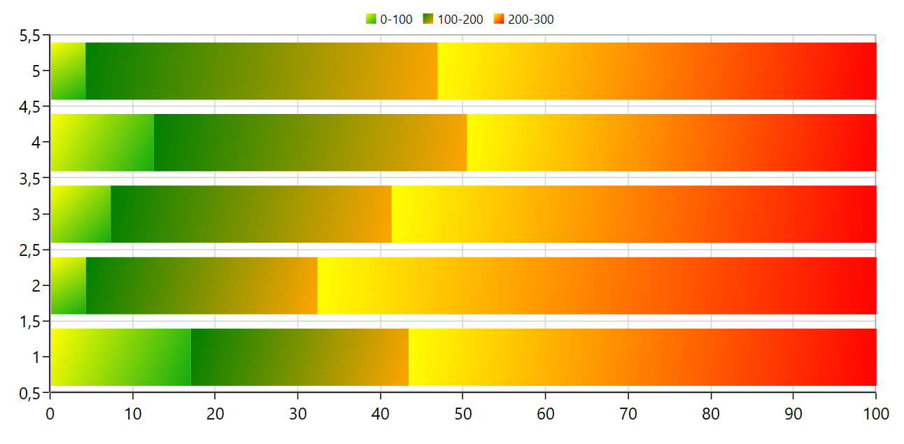

# How to apply the gradient color for each series in WPF Chart

This demo explains how to apply different gradient colors for each series in WPF chart.

WPF Chart allows us to visualize the segments in series with different gradient colors as per in below

 

It has been achieved by setting Interior value of series with LinearGradientBrush as per in below code snippet

**[XAML]**
```
  <chart:SfChart Margin="20" x:Name="chart" >

        <chart:SfChart.DataContext>
            <local:ViewModel/>
        </chart:SfChart.DataContext>

        <chart:SfChart.PrimaryAxis>
            <chart:NumericalAxis />
        </chart:SfChart.PrimaryAxis>

        <chart:SfChart.SecondaryAxis>
            <chart:NumericalAxis />
        </chart:SfChart.SecondaryAxis>

        <chart:SfChart.Legend>
            <chart:ChartLegend DockPosition="Top"/>
        </chart:SfChart.Legend>

         <!--Declare the series in which segments need to fill with different gradient-->

        <chart:StackingBar100Series XBindingPath="XValue"
                                         Label="0-100"
                                         YBindingPath="YValue1" 
                                         ItemsSource="{Binding Data}">

            <!--By setting the desired color with its offset, getting each segment gradient -->
            
          <chart:StackingBar100Series.Interior>
                <LinearGradientBrush>
                    <GradientStop Offset="0" Color="#ffff01" />
                    <GradientStop Offset="1" Color="#13ab11" />
                </LinearGradientBrush>
            </chart:StackingBar100Series.Interior>
        </chart:StackingBar100Series>
       …
    </chart:SfChart>     
```

**See Also**

[How to set color for the series ColorModel property](https://www.syncfusion.com/kb/5496/how-to-set-color-for-the-series-colormodel-property)

[How to define the fill color for each datapoint from ItemsSource](https://www.syncfusion.com/kb/5124/how-to-define-the-fill-color-for-each-datapoint-from-itemssource)

[How to change colors of specific data points in the chart](https://www.syncfusion.com/kb/10928/how-to-change-colors-of-specific-data-points-in-the-chart)

[How to add custom color model to series](https://www.syncfusion.com/kb/5480/how-to-add-custom-color-model-to-series)

